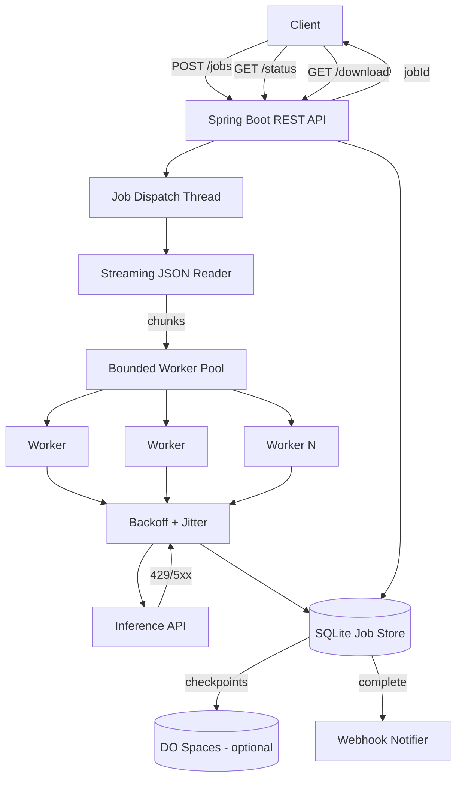

# Batch Inference Engine

Production-ready asynchronous batch evaluation service built in **Java 21 + Spring Boot**. It ingests a local JSON prompt file, returns a job ID immediately, fans out inference across a bounded worker pool with exponential backoff on rate limits, and aggregates per-row results.

Designed for **local development** and **DigitalOcean App Platform** deployment, with optional checkpoint streaming to **DigitalOcean Spaces**.

## Architecture



See [docs/architecture.md](docs/architecture.md) for scaling notes and component details.

## Inference Providers

| Provider | Use case | Config |
|----------|----------|--------|
| **DigitalOcean Gradient** (recommended for DO deploy) | Production on DO | `INFERENCE_PROVIDER=digitalocean`, `INFERENCE_API_KEY=<model access key>` |
| **Mock** (built-in) | Local dev, CI, tests | `INFERENCE_PROVIDER=mock` |
| **Ollama** (open source, self-hosted) | Free local LLM | Run Ollama, set `INFERENCE_PROVIDER=ollama`, `INFERENCE_BASE_URL=http://host.docker.internal:11434`, `INFERENCE_MODEL=llama3` |
| **Groq / Together / OpenRouter** | External hosted APIs | `INFERENCE_PROVIDER=openai` + provider base URL |

### DigitalOcean Serverless Inference

DigitalOcean provides managed inference at:

- Base URL: `https://inference.do-ai.run`
- Endpoint: `POST /v1/chat/completions`
- Auth: `Authorization: Bearer <MODEL_ACCESS_KEY>`
- Example model: `llama3-8b-instruct`

Create a model access key in the [DigitalOcean Gradient console](https://cloud.digitalocean.com/gen-ai), then:

```bash
export INFERENCE_PROVIDER=digitalocean
export INFERENCE_API_KEY=your-model-access-key
export INFERENCE_MODEL=llama3-8b-instruct
```

### Open Source Option: Ollama

[Ollama](https://ollama.com) is fully open source and exposes an OpenAI-compatible API:

```bash
ollama pull llama3
ollama serve
```

```bash
export INFERENCE_PROVIDER=ollama
export INFERENCE_BASE_URL=http://localhost:11434
export INFERENCE_MODEL=llama3
```

## Quickstart (Local)

### Prerequisites

- Java 21
- Maven 3.9+

### 1. Generate sample batch (1,000 prompts)

```bash
python3 scripts/generate_sample_batch.py
```

### 2. Run with mock inference (no API key)

```bash
mvn spring-boot:run
```

### 3. Submit a job

```bash
curl -s -X POST http://localhost:8080/jobs \
  -H 'Content-Type: application/json' \
  -d '{}' | jq
```

### 4. Poll status

```bash
JOB_ID=<from above>
curl -s http://localhost:8080/jobs/$JOB_ID/status | jq
```

### 5. Download results

```bash
curl -s http://localhost:8080/jobs/$JOB_ID/download | jq '.[0:3]'
```

### Docker

```bash
docker compose up --build
```

## API

| Method | Path | Description |
|--------|------|-------------|
| `POST` | `/jobs` | Accept batch file, return `jobId` (HTTP 202) |
| `GET` | `/jobs/{id}/status` | Progress: total, completed, succeeded, failed |
| `GET` | `/jobs/{id}/download` | Compiled result array (when complete) |
| `POST` | `/jobs/{id}/webhook` | Register completion callback URL |

**Create job body (optional):**

```json
{
  "inputFile": "sample_batch.json",
  "webhookUrl": "https://example.com/hooks/batch-complete"
}
```

**Input file format** (`data/sample_batch.json`):

```json
[
  { "id": "prompt-0001", "prompt": "Explain recursion in one sentence." }
]
```

## DigitalOcean Deployment

Repository: [github.com/pragesh/batch-inference-engine](https://github.com/pragesh/batch-inference-engine)

### Automated CI/CD (GitHub Actions)

| Workflow | Trigger | Action |
|----------|---------|--------|
| `ci.yml` | Push / PR | Runs `mvn verify` |
| `deploy.yml` | Push to `main` | Tests, then deploys to DO App Platform |

**Required GitHub secret** (Settings → Secrets and variables → Actions):

| Secret | Description |
|--------|-------------|
| `DIGITALOCEAN_ACCESS_TOKEN` | DO API token with read/write access |

**Required App Platform secret** (set in DO console or via app spec):

| Variable | Type | Description |
|----------|------|-------------|
| `INFERENCE_API_KEY` | Secret | DigitalOcean Gradient model access key |

The app spec lives at `.do/app.yaml` (Dockerfile build, `/health` check, 1Gi volume at `/tmp/data`).

### First-time setup

```bash
# 1. Authenticate (on your machine or this workstation)
gh auth login
doctl auth init

# 2. Clone and push (if not already done)
git clone https://github.com/pragesh/batch-inference-engine.git
cd batch-inference-engine

# 3. Add GitHub secret: DIGITALOCEAN_ACCESS_TOKEN

# 4. Push to main — deploy workflow runs automatically
git push origin main
```

### Manual deploy via doctl

```bash
doctl apps create --spec .do/app.yaml
# Updates on subsequent pushes are handled by the deploy workflow
```

### App Platform environment

| Variable | Value |
|----------|-------|
| `INFERENCE_PROVIDER` | `digitalocean` |
| `INFERENCE_API_KEY` | Model access key (secret) |
| `INFERENCE_MODEL` | `llama3-8b-instruct` |
| `WORKER_POOL_SIZE` | `10` |
| `DATA_DIR` | `/tmp/data` |

Mount a **persistent volume** at `/tmp/data` for SQLite job state (configured in `.do/app.yaml`).

### Verify deployment

```bash
curl https://<your-app>.ondigitalocean.app/health
curl -X POST https://<your-app>.ondigitalocean.app/jobs -H 'Content-Type: application/json' -d '{}'
```

### Spaces Checkpointing (extension)

Enable progressive block uploads for crash recovery on large jobs:

```bash
SPACES_ENABLED=true
SPACES_ENDPOINT=https://nyc3.digitaloceanspaces.com
SPACES_BUCKET=your-bucket
SPACES_ACCESS_KEY=...
SPACES_SECRET_KEY=...
```

## Scaling & Memory (500K items)

| Concern | Approach in this codebase |
|---------|----------------------------|
| Input file size | Jackson **streaming parser** reads JSON array in chunks — never loads 500K rows into heap |
| Result storage | Each row written to **SQLite** immediately — O(1) memory per worker |
| Concurrency | **Bounded** `Semaphore` + fixed thread pool — no unbounded task explosion |
| Download | Results read from DB on demand — not held in memory |
| Checkpoints | Optional spill to **Spaces** every N completed blocks |

**Ceiling:** SQLite handles hundreds of thousands of rows on a single node. Beyond ~1M rows or multi-instance deployments, migrate job store to PostgreSQL and use a distributed queue (Redis, DO Kafka).

## Testing

```bash
mvn test
mvn verify   # unit + integration
```

CI runs on every push via GitHub Actions (`.github/workflows/ci.yml`).

## Project Structure

```
src/main/java/com/batchinference/
  controller/     REST endpoints
  service/        Job orchestration, batch processing
  store/          SQLite persistence
  inference/      DO / OpenAI-compatible / mock clients
  retry/          Exponential backoff + jitter
  spaces/         DigitalOcean Spaces checkpoints
data/
  sample_batch.json
docs/
  architecture.md
```
