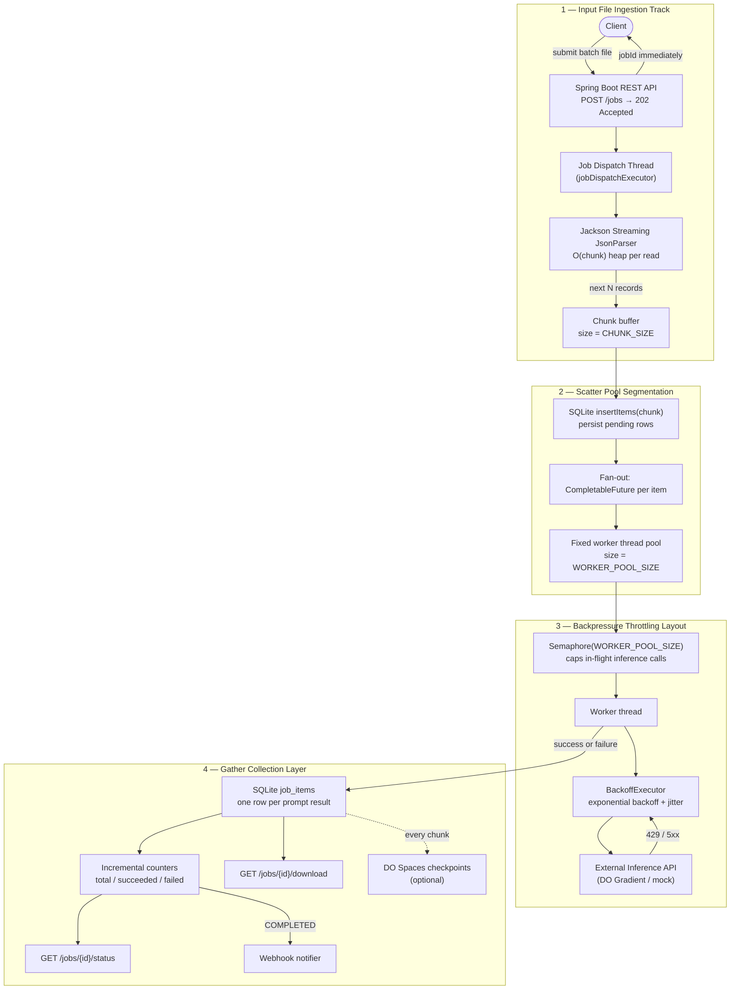

# Batch Inference Engine

Production-ready asynchronous batch evaluation service built in **Java 21 + Spring Boot**. It ingests a local JSON prompt file, returns a job ID immediately, fans out inference across a bounded worker pool with exponential backoff on rate limits, and aggregates per-row results.

Designed for **local development** and **DigitalOcean App Platform** deployment, with optional checkpoint streaming to **DigitalOcean Spaces**.

**Live deployment:** https://batch-inference-engine-d2asz.ondigitalocean.app

---

## Architecture Flow Diagram

The pipeline has four layers: **ingestion**, **scatter segmentation**, **backpressure throttling**, and **gather collection**.



See [docs/architecture.md](docs/architecture.md) for component-level detail and failure modes.

---

## Memory Footprint & Resource Throttling (500K items)

The design goal is **O(chunk size + worker pool)** heap usage, not O(dataset size). Here is how each code path avoids full-table OOM when scaling from 1,000 to **500,000** prompts.

| Stage | Code path | Memory behavior |
|-------|-----------|-----------------|
| **Input read** | `BatchFileReader.streamChunks()` uses Jackson `JsonParser` token streaming | Only one chunk (default 50 records) is materialized at a time. A 500K-row file is never deserialized into a single `List`. |
| **Item count** | `BatchFileReader.countItems()` calls `parser.skipChildren()` | Counts rows without loading prompt text into heap. |
| **Dispatch** | `BatchProcessor.processJob()` processes chunk-by-chunk | After each chunk completes (`CompletableFuture.allOf(...).join()`), chunk references are released before the next chunk is read. |
| **Concurrency cap** | `Semaphore(WORKER_POOL_SIZE)` in `BatchProcessor` | At most N inference calls are in flight regardless of file size. Prevents unbounded task queue growth. |
| **Thread pool** | Fixed `ExecutorService` in `AppConfig` | Worker count is bounded; no `newCachedThreadPool` for inference work. |
| **Result storage** | `JobStore.markItemSuccess/Failed()` per row | Each result is written to SQLite immediately; results are not accumulated in an in-memory map. |
| **Download** | `JobStore.getResults()` reads from DB on demand | Client receives a list at download time only; during processing, nothing holds the full result set in heap. |
| **Retry backoff** | `BackoffExecutor` sleeps with jitter | Prevents thundering herd on 429 rate limits without spawning extra threads. |

### Scaling ceilings and reasoning

| Scale | Expected behavior | Bottleneck | Mitigation |
|-------|-------------------|------------|------------|
| **1K prompts** | ~1–3 min on DO `basic-xxs` with live LLM | None for memory | Default config (`WORKER_POOL_SIZE=10`, `CHUNK_SIZE=50`) |
| **100K prompts** | Hours of wall time; heap stays flat | SQLite write throughput, upstream rate limits | Lower pool size, increase backoff, optional Spaces checkpoints |
| **500K prompts** | Multi-hour job; heap still O(chunk+pool) | Disk I/O on SQLite DB, inference latency | Tune `CHUNK_SIZE`, enable Spaces for crash recovery, run on larger instance |
| **500K+ / multi-instance** | SQLite is single-node | Shared state | Migrate to PostgreSQL + Redis/SQS queue (documented extension path) |

**What would OOM:** loading the entire JSON array into memory, unbounded `CompletableFuture` submission without a semaphore, or holding all results in a `Map` until job completion. None of these patterns exist in this codebase.

---

## Quickstart (1,000-prompt template)

### Prerequisites

- Java 21
- Maven 3.9+

The repo ships `data/sample_batch.json` with **1,000 prompts**. Regenerate it with:

```bash
python3 scripts/generate_sample_batch.py
```

### Run locally (mock inference — no API key)

```bash
mvn spring-boot:run
```

### Submit the 1,000-prompt batch

```bash
curl -s -X POST http://localhost:8080/jobs \
  -H 'Content-Type: application/json' \
  -d '{"inputFile":"sample_batch.json"}' | jq
```

### Poll status

```bash
JOB_ID=<from above>
curl -s http://localhost:8080/jobs/$JOB_ID/status | jq
```

### Download results (when `status` is `COMPLETED`)

```bash
curl -s http://localhost:8080/jobs/$JOB_ID/download | jq '.[0:3]'
```

### Partial results (while job is still `RUNNING`)

Each completed row is written to SQLite immediately. Poll counts via `/status`, then fetch answers so far:

```bash
# Counts only
curl -s http://localhost:8080/jobs/$JOB_ID/status | jq '{succeeded, failed, completed, total}'

# Actual answers for completed items (excludes pending)
curl -s http://localhost:8080/jobs/$JOB_ID/results | jq '.[0:3]'

# Only successes
curl -s "http://localhost:8080/jobs/$JOB_ID/results?status=SUCCESS" | jq length

# Paginate large jobs
curl -s "http://localhost:8080/jobs/$JOB_ID/results?limit=100&offset=0" | jq
```

`/download` still returns **409 Conflict** until the job finishes; use `/results` for incremental snapshots.

### Production (DigitalOcean)

```bash
curl -s -X POST https://batch-inference-engine-d2asz.ondigitalocean.app/jobs \
  -H 'Content-Type: application/json' \
  -d '{"inputFile":"sample_batch.json"}' | jq

curl -s https://batch-inference-engine-d2asz.ondigitalocean.app/health/inference | jq
```

### Docker

```bash
docker compose up --build
```

---

## API

| Method | Path | Description |
|--------|------|-------------|
| `POST` | `/jobs` | Accept batch file, return `jobId` (HTTP 202) |
| `GET` | `/jobs/{id}/status` | Progress: total, completed, succeeded, failed |
| `GET` | `/jobs/{id}/results` | **Partial results** — completed items while job is still running |
| `GET` | `/jobs/{id}/download` | Full result array (HTTP 409 while running) |
| `POST` | `/jobs/{id}/webhook` | Register completion callback URL |
| `GET` | `/health` | Liveness probe |
| `GET` | `/health/inference` | Inference config + live probe |

**Input file format** (`data/sample_batch.json`):

```json
[
  { "id": "prompt-0001", "prompt": "Explain recursion in one sentence." }
]
```

---

## Testing

```bash
mvn test          # unit tests
mvn verify        # unit + integration (full suite)
```

### Test coverage matrix

| Area | Test class | Scenarios covered |
|------|------------|-------------------|
| **Streaming ingestion** | `BatchFileReaderTest` | Chunked reads, 250-item batch, invalid JSON root |
| **Retry / backpressure** | `BackoffExecutorTest` | 429 retry until success, non-retryable 4xx fast-fail |
| **Inference mock** | `MockInferenceClientTest` | Happy path, `CORRUPT_INPUT` failure |
| **End-to-end job** | `JobIntegrationTest` | POST → status → download; partial failures (`CORRUPT_INPUT`) |
| **REST API** | `JobApiIntegrationTest` | 404 unknown job, 400 missing file, 409 download while running, 25-item chunked batch |
| **Health endpoints** | `HealthIntegrationTest` | `/health`, `/health/inference` (mock provider) |

Integration tests run with `INFERENCE_PROVIDER=mock` — no external API key required in CI.

---

## CI/CD

| Workflow | Trigger | Action |
|----------|---------|--------|
| [`ci.yml`](.github/workflows/ci.yml) | Push / PR to `main` | `mvn -B verify` (full test suite) |
| [`deploy.yml`](.github/workflows/deploy.yml) | Push to `main` | Tests, then deploy to DO App Platform |

**Required GitHub secrets:**

| Secret | Description |
|--------|-------------|
| `DIGITALOCEAN_ACCESS_TOKEN` | DO API token |
| `INFERENCE_API_KEY` | Gradient model access key (injected on deploy) |
| `DO_PROJECT_ID` | Optional — target DO project for new app creation |

---

## Inference Providers

| Provider | Use case | Config |
|----------|----------|--------|
| **DigitalOcean Gradient** | Production on DO | `INFERENCE_PROVIDER=digitalocean`, `INFERENCE_API_KEY=<model access key>` |
| **Mock** | Local dev, CI, tests | `INFERENCE_PROVIDER=mock` |
| **Ollama** | Self-hosted LLM | `INFERENCE_PROVIDER=ollama`, `INFERENCE_BASE_URL=http://localhost:11434` |
| **OpenAI-compatible** | Groq, Together, etc. | `INFERENCE_PROVIDER=openai` + base URL |

Production model: `llama3.3-70b-instruct` at `https://inference.do-ai.run/v1/chat/completions`.

---

## DigitalOcean Deployment

Repository: [github.com/pragesh/batch-inference-engine](https://github.com/pragesh/batch-inference-engine)

App spec: [`.do/app.yaml`](.do/app.yaml) — Dockerfile build, `/health` check, env vars for inference.

### App Platform environment

| Variable | Value |
|----------|-------|
| `INFERENCE_PROVIDER` | `digitalocean` |
| `INFERENCE_API_KEY` | Model access key (secret, injected via GitHub Actions) |
| `INFERENCE_MODEL` | `llama3.3-70b-instruct` |
| `WORKER_POOL_SIZE` | `10` |
| `CHUNK_SIZE` | `50` |
| `DATA_DIR` | `/app/data` |

### Spaces checkpointing (extension)

Enable progressive block uploads for crash recovery on large jobs:

```bash
SPACES_ENABLED=true
SPACES_ENDPOINT=https://nyc3.digitaloceanspaces.com
SPACES_BUCKET=your-bucket
SPACES_ACCESS_KEY=...
SPACES_SECRET_KEY=...
```

---

## Project Structure

```
src/main/java/com/batchinference/
  controller/     REST endpoints + health
  service/        Job orchestration, batch processing, streaming reader
  store/          SQLite persistence
  inference/      DO / OpenAI-compatible / mock clients
  retry/          Exponential backoff + jitter
  spaces/         DigitalOcean Spaces checkpoints
src/test/java/
  integration/    End-to-end Spring Boot tests
  service/        BatchFileReader unit tests
  retry/          BackoffExecutor unit tests
  inference/      Mock client unit tests
data/
  sample_batch.json   # 1,000-prompt template
docs/
  architecture.md
```
